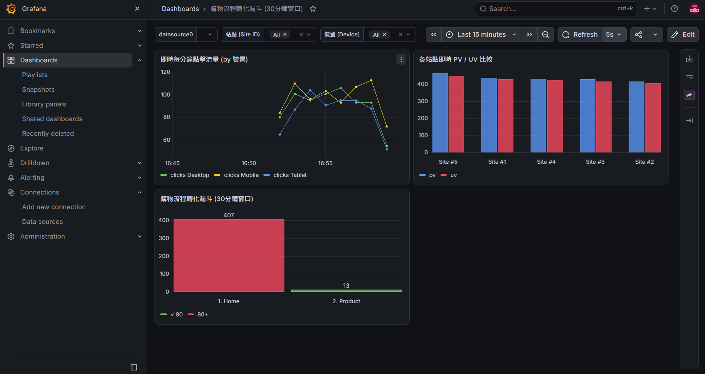

# Real-Time Clickstream ELT Pipeline

基於 Docker 構建的一鍵全自動即時電商點擊流分析平台。資料由容器化的 Python 模擬器自動生成，經由 Redpanda（Kafka API）串流隊列，透過 Materialized View 即時預聚合寫入 ClickHouse 列式資料庫，並在 Grafana 實現即時儀表板監控與動態維度過濾。

---

## 📊 成果展示 (Dashboard Preview)

<p align="center">
  
</p>

---

## 系統架構 (Architecture)

```text
[ Python Producer Container ] (支援隨時暫停/熱更新模擬邏輯)
        │ (即時發送 JSON Events)
        ▼
[ Redpanda (Kafka API) ]
        │ (Topic: clickstream_events)
        ▼
[ ClickHouse ]
  ├── clickstream_queue             (Kafka Engine 表，負責拉取隊列資料)
  │       │
  │       ▼ (透過第一層物化視圖自動轉移)
  ├── clickstream_mv                (Materialized View 1: 寫入原始明細)
  │       │
  │       ▼
  ├── clickstream_records           (MergeTree 實體表: 儲存所有原始事件明細)
  │       │
  │       ▼ (透過第二層物化視圖即時聚合)
  ├── clickstream_min_mv            (Materialized View 2: 分鐘級聚合輸送帶)
  │       │
  │       ▼
  └── clickstream_minute_stats      (SummingMergeTree 實體表: 分鐘維度預聚合統計)
        │
        │ (HTTP 8123 查詢)
        ▼
[ Grafana Dashboard ] (即時圖表 & 篩選器)
```

---

## 技術棧 (Tech Stack)

* **訊息隊列**：Redpanda (相容 Kafka API)
* **列式資料庫**：ClickHouse (自動掛載 `01_init.sql` 初始化表結構)
* **視覺化**：Grafana (含 ClickHouse 官方外掛，自動載入 Dashboard)
* **資料產生器**：Python 3 (容器化獨立服務，支援本機代碼熱掛載)
* **容器編排**：Docker & Docker Compose

---

## 快速開始 (Quick Start)

### 1. 前置需求 (Prerequisites)
* Docker & Docker Compose

### 2. 一鍵啟動全管線
專案已完全容器化，啟動時會自動完成：資料庫初始化、自動產生模擬數據、載入 Grafana 儀表板。

```bash
git clone [https://github.com/mmm4000/Real-Time-Clickstream-ELT-Pipeline.git](https://github.com/mmm4000/Real-Time-Clickstream-ELT-Pipeline.git)
cd Real-Time-Clickstream-ELT-Pipeline
docker compose up -d
```

---

## 模擬資料流量控制 (Producer Control)

Producer 作為獨立容器運行，可隨時手動開啟或暫停資料生成，且支援本機熱更新：

* **暫停產生資料**：
  ```bash
  docker stop elt-producer
  ```
* **恢復產生資料**：
  ```bash
  docker start elt-producer
  ```
* **查看即時生產日誌**：
  ```bash
  docker logs -f elt-producer
  ```
* **熱更新模擬邏輯**：
  在專案目錄下直接修改本機的 `producer.py`，完成後執行以下指令即可立即生效，無需重新構建 Image：
  ```bash
  docker restart elt-producer
  ```

---

## 儀表板檢視 (Grafana Dashboard)

* **URL**：`http://localhost:3000`
* **預設帳號/密碼**：`admin` / `admin`
* **自動配置 (Provisioning)**：
  * 資料來源：已自動配置 ClickHouse（HTTP 協定，Port `8123`）
  * 儀表板功能：
    * **每分鐘裝置流量折線圖**（Time Series，支援 `device_type` 篩選）
    * **各站點即時 PV / UV 統計**（Bar Chart，支援 `site_id` 篩選）
    * **購物流程轉化漏斗**（Funnel / Bar Chart）

---

## 專案結構 (Directory Structure)

```text
.
├── docker-compose.yml              # 容器編排設定 (含 Redpanda, ClickHouse, Grafana, Producer)
├── Dockerfile.producer             # Producer 容器化映像檔建置檔
├── producer.py                     # 點擊串流模擬腳本 (掛載支援熱更新)
├── requirements.txt                # Python 套件相依清單
├── init-clickhouse/
│   └── 01_init.sql                 # ClickHouse 初始化 SQL (標準 UTF-8 無 BOM)
├── grafana-provisioning/
│   ├── datasources/
│   │   └── datasources.yaml        # 自動綁定 ClickHouse 資料來源
│   └── dashboards/
│       ├── dashboards.yaml         # Dashboard 自動配置規則
│       └── clickstream.json        # 儀表板模型定義檔
├── docs/
│   └── images/
│       └── grafana_dashboard.png   # 儀表板成果展示截圖
└── README.md
```